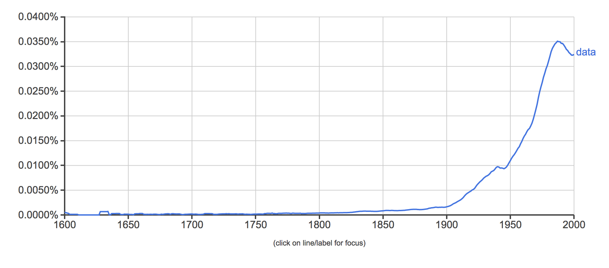

# Qui suis-je?
.pull-left[- Spécialiste de l’open data : j’ai cofondé [Datactivist](datactivi.st), une société coopérative qui a pour mission d’ouvrir des données et de les rendre utiles. 

- Militant de l’ouverture, j’ai co-fondé [Open Knowledge France](okfn.fr). 

- Chercheur sur l’open data, j’ai fait ma thèse de doctorat en sociologie ["Instaurer des données, instaurer des publics : une enquête sociologique dans les coulisses de l'open data"](https://pastel.archives-ouvertes.fr/tel-01458098) sur le sujet. 
]
.pull-right[

]

---
class: center, middle

Ces slides en ligne : http://datactivist.coop/sciencespoaix_enjeuxinfo/

Les productions de Datactivist sont librement réutilisables selon les termes de la licence [Creative Commons 4.0 BY-SA](https://creativecommons.org/licenses/by-sa/4.0/legalcode.fr).

---
class:middle, center
# A votre tour de vous présenter

---
# Objectifs du cours
.pull-left[
#### Développer votre culture générale des données et du numérique

#### Lire et retenir sur certains concepts essentiels liés aux données et à l'information numérique

#### Découvrir des débouchés professionnels dans les données numériques]

.pull-right[

]

---
# Règles du jeu

.pull-left[
#### Des séances courtes et rythmées

#### Pas ou peu de cours magistral

#### Des lectures obligatoires

#### Un cours basé sur la participation active des étudiants
]

.pull-right[

]
---
#Organisation des séances

#### Séance 1 : Data-Information-Knowledge

📅 
1/02, 11h-13h

📖
Rien

#### Séance 2 : From small to big data

📆 
06/02, 10h-13h

📖 
Rob Kitchin, *The Data Revolution* : Chapitres 2 et 4

#### Séance 3 : Open Data

📆 
13/02, 11h-13h

📖
Rob Kitchin, *The Data Revolution* : Chapitre 3

---
#Organisation des séances

#### Séance 4 : Crowdsourced data

📅 
19/02, 11h-13h

📖
Denis Jérôme et Pontille David, « Une infrastructure élusive » Aménagements cyclables et troubles de la description dans OpenStreetMap, Réseaux,  2013/2

#### Séance 5 : Data visualisation

📆 
21/02, 13h-15h

📖 
Manuel de data visualisation

---
#Organisation des séances

#### Séance 6 : Data science

📅 
26/02, 16h-18h

📖
Éric Dagiral et Sylvain Parasie, [La « science des données » à la conquête des mondes sociaux : ce que le « Big Data » doit aux épistémologies locales](http://books.openedition.org/cdf/4999)

#### Séance 7 : Open Knowledge

📆 
A définir

📖 
A définir

#### Séance 9 : Open Government

📆 
A définir

📖
A définir

---
class:center, middle

# Séance 10 : évaluation

### A définir ensemble

---
class:middle, center
## Echauffement : 5 minutes, 20 données

Vous avez 5 minutes

Vous devez trouver 20 données dans notre environnement immédiat

Pas de recours aux écrans !

.footnote[[source](http://infolabs.io/5-minutes-20-donnees)]

---
class:center,inverse, middle
# Qu'est-ce qu'une donnée ?

#D'après vous ?
---
## Data-Information-Knowledge-Wisdom
.pull-left[

]

.pull-right[Attribuée à [Russell Ackoff](http://en.wikipedia.org/wiki/Russell_L._Ackoff), 1989

Les données peuvent être des :

- faits
- signal/stimulis
- symboles]

---
## Etymologie

### Latin : _dare_ (donner) > _datum_ (donné) > _data_ (donnés)
  
Ce qui est évident, va de soi, est accepté sans discussion

  

> From its first vernacular formulation, the existence of a datum has been independent of any
consideration of corresponding ontological truth. When a fact is proven false, it ceases
to be a fact. False data is data nonetheless.

.footnote[[Rosenberg, 2013](https://mitpress.mit.edu/books/raw-data-oxymoron)]
---
class:middle
## Usage de "data"

.pull-left[
Le sens moderne apparaît à la fin du 18e siècle. 

Renvoie à des expériences, des collectes d'éléments.]
.pull-right[]
---
# “Datafication” : la mise en données du monde
> “L'immense gisement de données numériques découle de la capacité à paramétrer des aspects du monde et de la vie humaine qui n'avaient encore jamais été quantifiés. On peut qualifier ce processus de **« mise en données » (datafication)**. 

> […] “La mise en données désigne autre chose que la numérisation, laquelle consiste à traduire un contenu analogique - texte, film, photographie - en une séquence de 1 et de 0 lisible par un ordinateur. Elle se réfère à une action bien plus vaste, et aux implications encore insoupçonnées : **numériser non plus des documents, mais tous les aspects de la vie**.”

.footnote[[Kenneth Cukier, “Mise en données du monde, le déluge numérique”](https://www.monde-diplomatique.fr/2013/07/CUKIER/49318)]
---

# La "nombrification" du monde
.pull-left[]
.pull-right[
> La numérisation ne serait pas survenue sans une "nombrification" préalable qui consiste à quantifier de plus en plus d'aspects de notre expérience du réel.

> **Au commencement était le verbe, il semble à la fin que tout devient nombre.**

> Personne ne saurait parler sérieusement de l'état de la société et discuter politique sans se référer aux informations quantitatives. ]

---
# Vers une définition des données
.pull-left.reduite2[

]
.pull-right[
> *Data are commonly understood to be the raw material produced by **abstracting the world** into categories, measures and other representational forms – numbers, characters, symbols, images,sounds, electromagnetic waves, bits – that constitute the **building blocks** from which information and knowledge are created.*

⏺ enregistrabilité

🏗> briques de base ("*buildings blocks*")]

---
class:middle
# Data or capta ?

> *Technically, then, what we understand as data are actually **capta** (derived from the Latin capere, meaning ‘to take’); those units of data that have been selected and harvested from the sum of all potential data.*

[Kitchin, 2014](https://books.google.fr/books?hl=fr&lr=&id=GfOICwAAQBAJ&oi=fnd&pg=PP1&dq=kitchin+data+revolution&ots=pcyfMTZh-V&sig=dQyPTL3AIN_4RdWvtBFw4VjdAa4#v=onepage&q=kitchin%20data%20revolution&f=false)

---
class:middle
# Données ou obtenues ? 

> « Décidément, on ne devrait jamais parler de “données”, mais toujours d’ “obtenues”. » 

Bruno Latour, 1993
